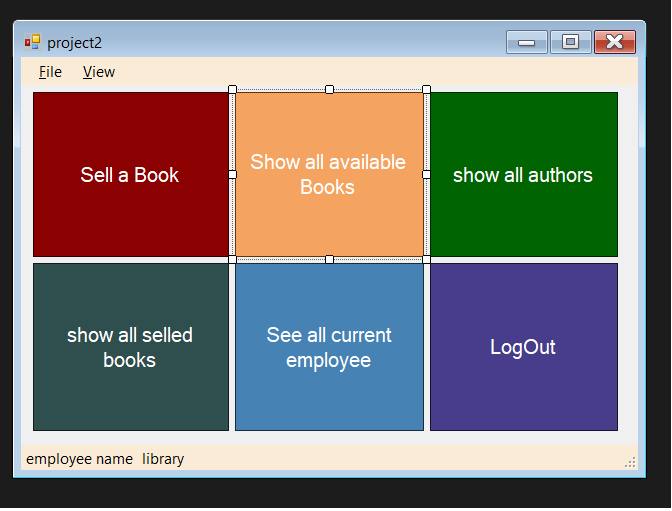

# Library-management-system
these are some screenshoots from the project their is still more page not sceen shooted
# main page

# log in page

# sell a book page

#show all selled booked and receipts

#the database
